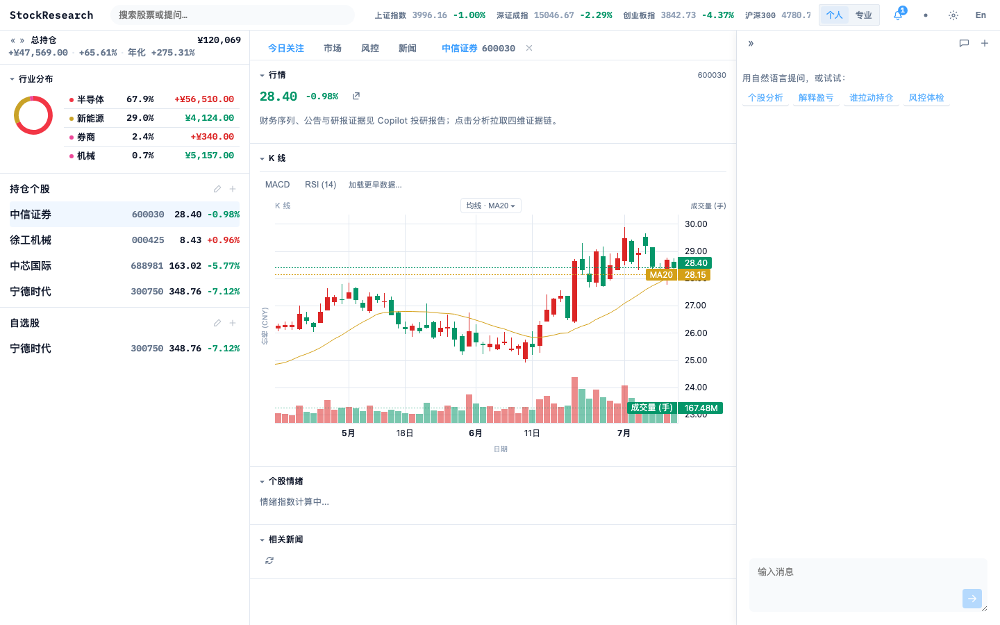
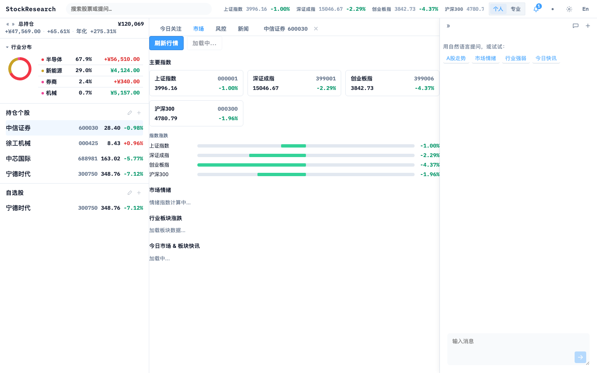
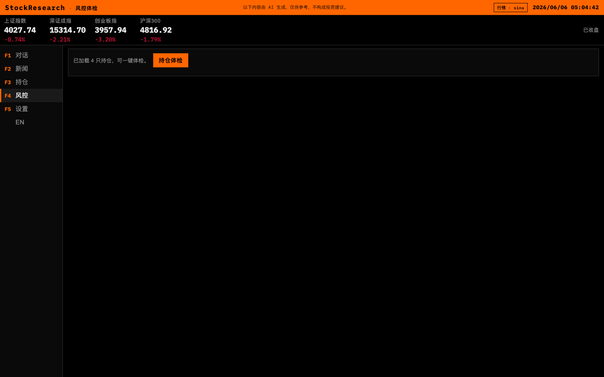
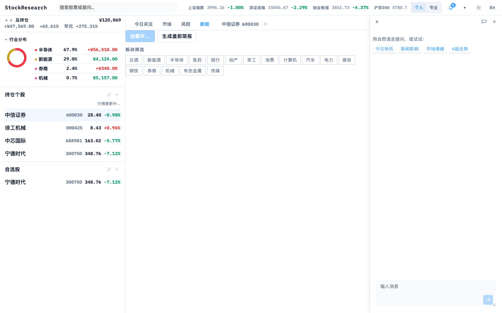
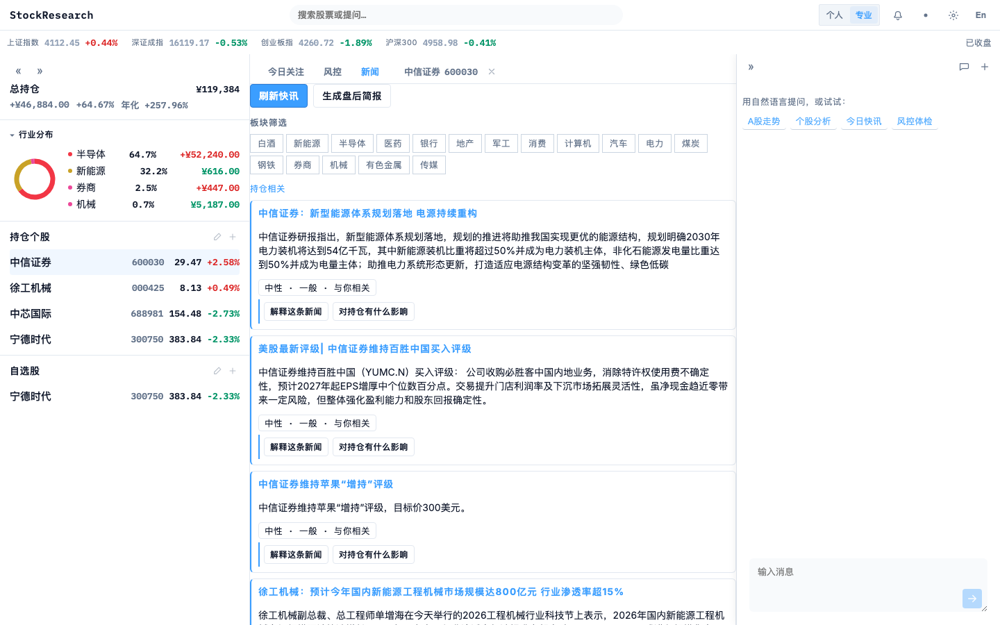
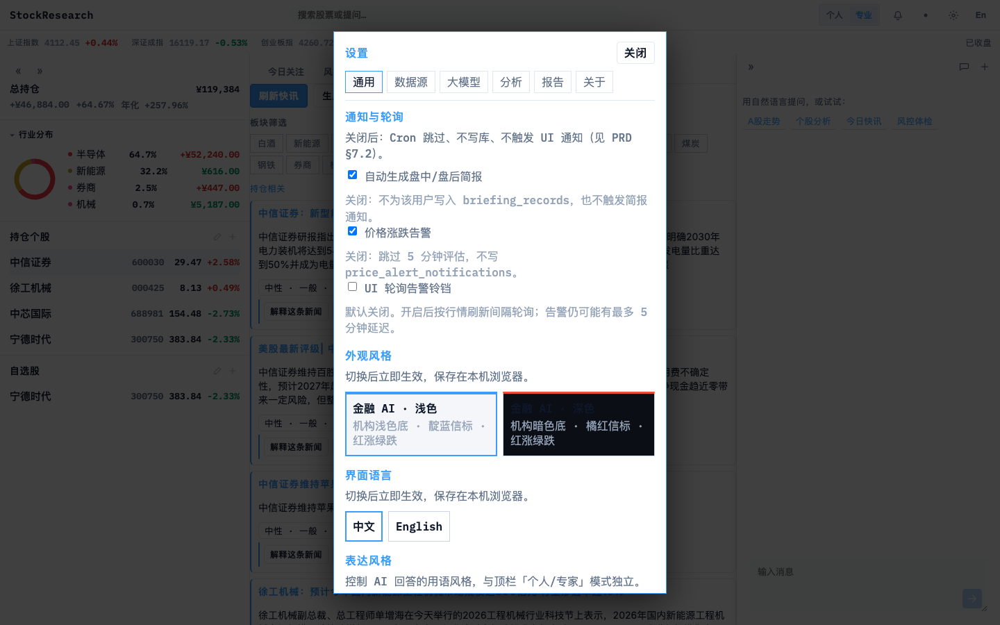
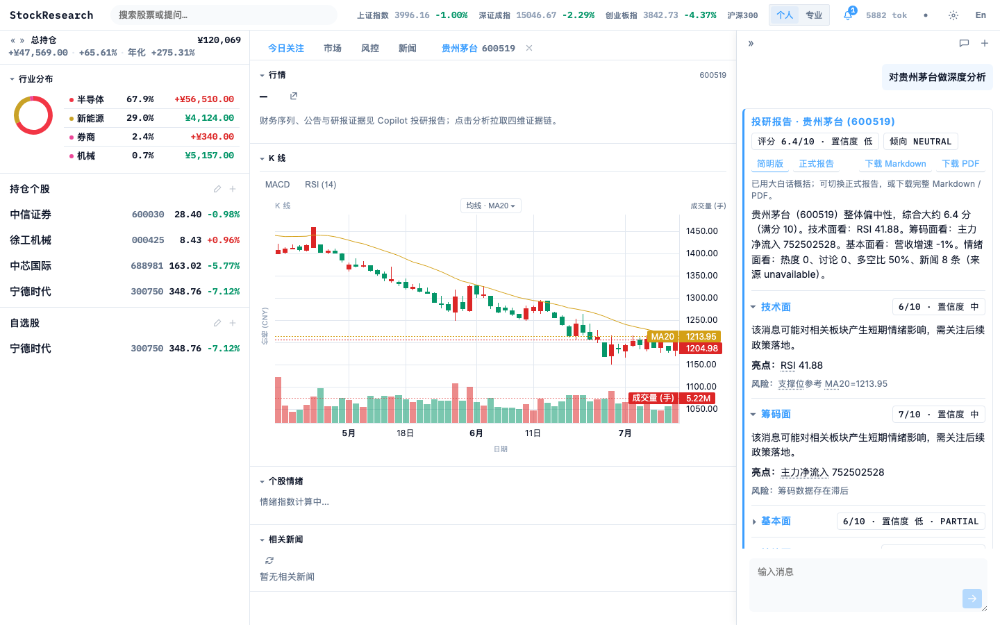

# StockResearch

**[中文](#中文) · [English](#english)** · [PRD v10.16](docs/PRD.md)

[](pyproject.toml)
[](LICENSE)

| | |
|--|--|
| 源码 / Source | [github.com/Miles128/StockResearch](https://github.com/Miles128/StockResearch) |
| PRD | [docs/PRD.md](docs/PRD.md) |

---

## 开源 A 股市场研究 Agent

本机运行的 A 股 AI 研究助手：LangGraph 多 Agent 投研 + React 三栏 UI。**不连券商、不代交易**，帮助理解「今天发生了什么、与我何关、还需验证什么」。北极星：**证据是否充分 · 结论能否被事后验证**。

```text
┌─ 顶栏：指数 · 搜索 · 模式 · 告警 · 数据源 · 设置 ─────────────────────┐
├ lists ─────────┬─ center: [焦点][市场][风控][新闻] ┬─ Copilot ───────────┤
│ 持仓 · 自选    │ K线 · 多 Tab · ActionCenter      │ 多线程 · SSE · 免责  │
└────────────────┴─────────────────────────────────┴───────────────────────┘
```

### 核心能力

- **四维投研报告**：基本面 / 估值 / 筹码情绪 / 新闻情绪，每条结论附证据链；缺数显式 `partial`，禁止编造
- **三档分析深度**：standard / comprehensive / deep（`analysis_depth` 全局设置，对话可临时覆盖）
- **深度分析三层**（deep 档）：Impact（事件冲击 · 事件研究）→ Pricing（估值桥）→ Thesis（论点与压测）
- **研究验证可外带**：复盘时间线、事后核对（PIT）、事件研究、假设一键验证、个股对比、JSON/CSV/Markdown/PDF 导出
- **意图路由对话**：五类意图分类（个股 / 市场 / 行业 / 新闻 / 通用），按意图装配上下文，新闻与工具按 scope 过滤
- **K 线自动趋势线**：摆动点拟合支撑 / 压力虚线（≤4 条，默认开，非交易信号）；滚轮 / 触控板缩放
- **大师点评与辩论**：Buffett / Munger / Burry 人格化点评（仅研究语境）；多空辩论
- **自选研究雷达**：零 LLM 规则信号进 Action Center（非交易信号文案）
- **个人 / 专家**双模式：同一事实层 JSON，不同渲染密度与合规过滤
- **BYOK**：LLM / Tushare / 博查 Key 存浏览器或 `.env`，不上云

> **免责声明**：AI 输出仅供学习与研究，不构成投资建议。

---

## 数据源

所有结论可追溯来源；失败时显式 `partial` / 降级，禁止 LLM 编造。多源价差 **>1%** 时顶栏黄色预警。

| 数据域 | 主源 | 备源（按序） | 说明 |
|--------|------|--------------|------|
| **实时行情** | [新浪财经](https://finance.sina.com.cn) `hq.sinajs.cn` | AkShare → [efinance](https://github.com/Micro-sheep/efinance) | 三源兜底；Sina 与 AkShare 价差 >1% 告警 |
| **K 线** | AkShare（前复权 `stock_zh_a_hist`） | efinance → Tushare（有 Token）→ 新浪 | 指数用 `index_zh_a_hist`；本地日线仓增量缓存 |
| **指数概览** | 新浪指数 | AkShare | 北向资金：AkShare 东方财富接口 |
| **新闻快讯** | AkShare（东方财富） | [博查 AI 搜索](https://open.bochaai.com) | 博查需 `BOCHA_API_KEY`；≤3s SLA，零 LLM |
| **公告** | 巨潮资讯 via AkShare | — | `stock_zh_a_disclosure_report_cninfo` |
| **机构研报** | 东方财富 via AkShare | — | `stock_research_report_em` |
| **财务/估值** | AkShare | **Tushare Pro**（可选增强） | 有 Token 时作估值与 qfq 兜底；冲突 UI 并列预警 |
| **筹码/情绪** | AkShare | 雪球热度 | 龙虎榜、资金流、北向、两融、股东户数、解禁等 |

**不做** iFinD / Wind / Choice 等万元级终端 API。

---

## 界面预览

| 今日关注 | 市场 | 风控 |
|:---:|:---:|:---:|
|  |  |  |

| 新闻 | Copilot | 设置 |
|:---:|:---:|:---:|
|  |  |  |



---

<a id="中文"></a>

## 中文

### 快速开始

**环境**：Python 3.12+、[uv](https://docs.astral.sh/uv/)、Node.js 18+

```bash
git clone https://github.com/Miles128/StockResearch.git && cd StockResearch
uv sync && cp .env.example .env

# 终端 1 — API
uv run uvicorn stockresearch.api.app:app --reload --host 127.0.0.1 --port 8000 --app-dir src

# 终端 2 — 后台调度 worker（简报/价格告警/日线仓）
uv run python -m stockresearch worker

# 终端 3 — Web
cd web && npm install && npm run dev
```

打开 **http://localhost:5174**。首次引导：选模式 → Demo 持仓 → 配置 LLM（或 `USE_MOCK_LLM=true` 先体验）。

桌面壳（Tauri 2，macOS / Windows；需本机 `uv` + 已构建前端）：

```bash
cd web && npm run build
cd ../desktop && npm install && npm run dev
```

详见 [desktop/README.md](desktop/README.md)。

### 命令行外带（JSON）

```bash
uv run stockresearch research timeline 600519
uv run stockresearch research export <report_id> --format json
```

便于 Jupyter / 管道消费；与 HTTP 研究验证 API 同源（MCP server 在路线图上）。

### 环境变量

见 [.env.example](.env.example)。

| 变量 | 说明 |
|------|------|
| `LLM_API_KEY` / `LLM_BASE_URL` / `LLM_MODEL` | OpenAI 兼容大模型（DeepSeek、DashScope 等） |
| `USE_MOCK_LLM` | `true` 无 Key 演示 |
| `BOCHA_API_KEY` | 博查联网搜索（新闻兜底，可留空） |

Tushare Token 在设置页填写（浏览器 BYOK），非 `.env` 必填项。

### 验证

```bash
uv run pytest && cd web && npm run build
```

### 文档

- 产品规格：[docs/PRD.md](docs/PRD.md)（V10.16，含路线图实现状态标注）
- Agent 开发：[AGENTS.md](AGENTS.md)

MIT — 见 [LICENSE](LICENSE)。

---

<a id="english"></a>

## English

Open-source **A-share market research agent** running locally. LangGraph multi-agent research + React tri-shell UI (lists · focus · copilot). No broker connection, no trading.

**Highlights**: four-dimension evidence-chained reports · three analysis depths (standard/comprehensive/deep) · deep-analysis stack (Impact → Pricing → Thesis) · portable verification (timeline, post-hoc PIT checks, event study, hypothesis verify, JSON/CSV/MD/PDF export) · intent-routed chat context · auto trendlines on K-line charts · Buffett/Munger/Burry persona commentary & bull-bear debates.

**Dual mode**: Advisor (plain language) / Research (full metrics) — same fact layer, different rendering.

### Quick start

```bash
git clone https://github.com/Miles128/StockResearch.git && cd StockResearch
uv sync && cp .env.example .env

# Terminal 1 — API
uv run uvicorn stockresearch.api.app:app --reload --host 127.0.0.1 --port 8000 --app-dir src

# Terminal 2 — Background worker (briefings, price alerts, daily-bar store)
uv run python -m stockresearch worker

# Terminal 3 — Web
cd web && npm install && npm run dev   # http://localhost:5174
```

Desktop shell (Tauri 2, macOS/Windows): build `web` first, then `cd desktop && npm install && npm run dev`. See [desktop/README.md](desktop/README.md).

### Data sources

See the table above. Layered fallbacks: **Sina → AkShare → efinance** for quotes; **AkShare (qfq) → efinance → Tushare → Sina** for K-lines. News via AkShare with optional Bocha web search. AkShare primary for financials with optional Tushare Pro enhancement. No Wind/iFinD/Choice.

### Verify

```bash
uv run pytest && cd web && npm run build
```

Full spec: [docs/PRD.md](docs/PRD.md) · MIT [LICENSE](LICENSE).
