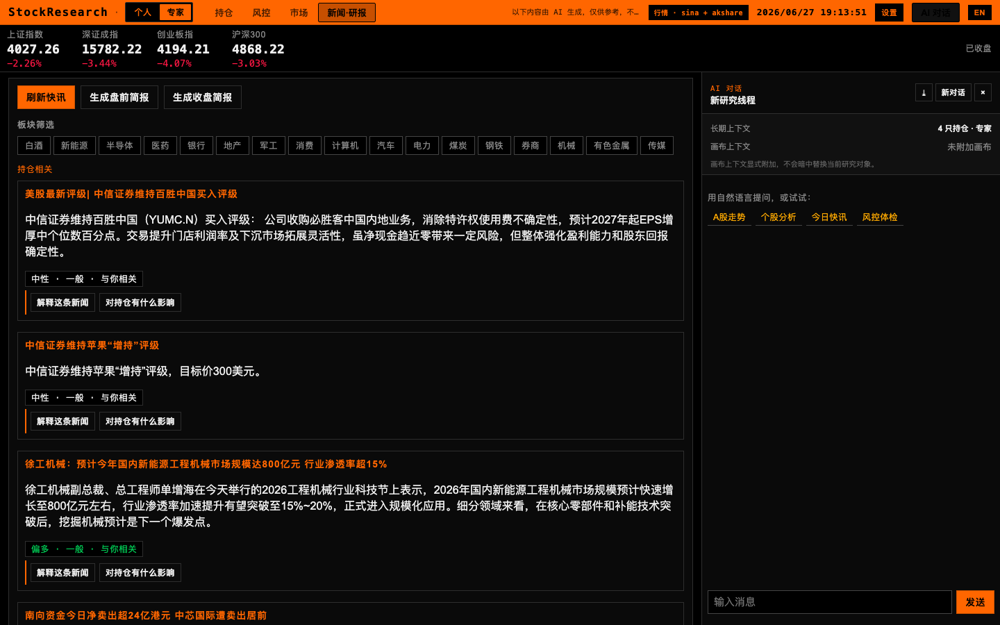
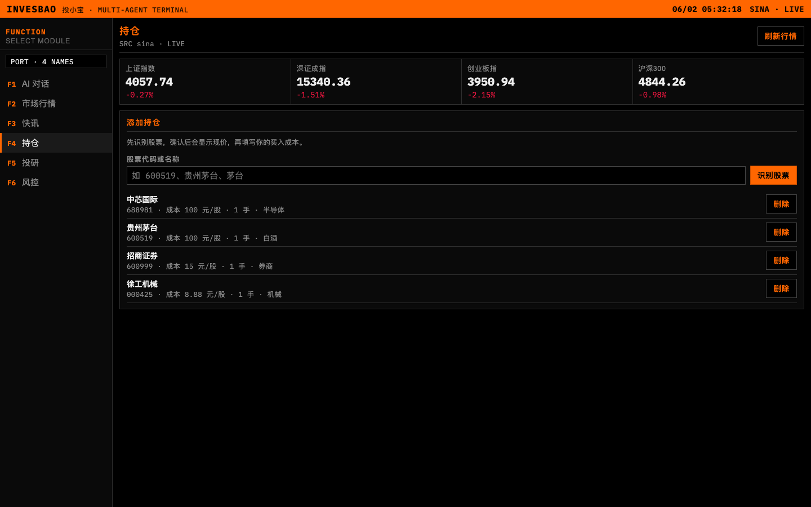
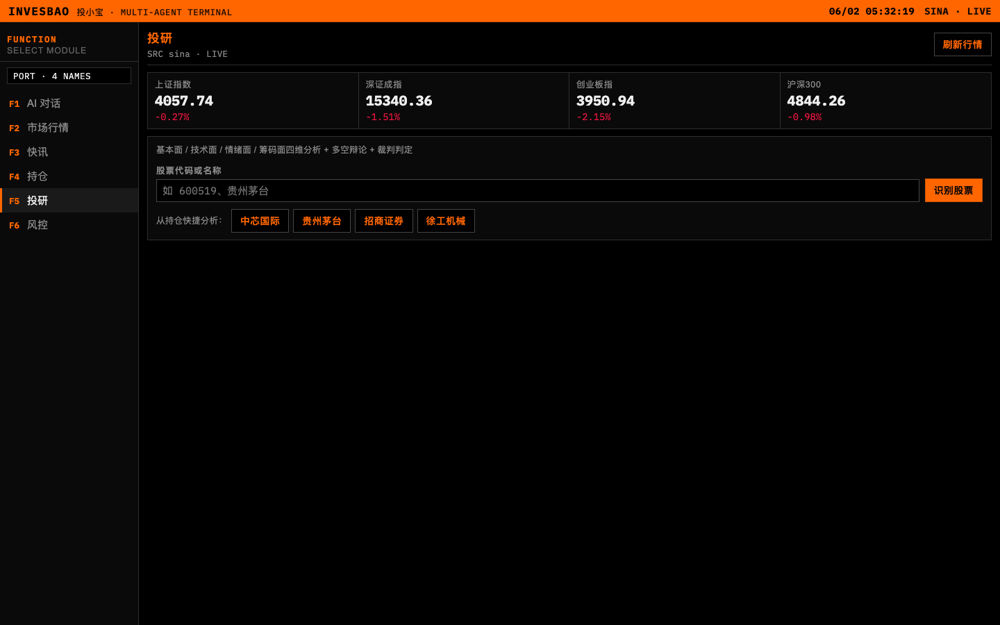

# StockResearch

面向 A 股个人投资者的 **Multi-Agent AI 投研终端**（Phase 1 MVP，原 InvesBao / StockBuddy / 投小宝）。界面采用 Bloomberg 风格终端布局，后端以 LangGraph 编排多个独立 Agent，支持 SSE 流式输出。



## 功能概览

| 模块 | 说明 |
|------|------|
| **AI 对话** | 意图路由 → 新闻 / 投研 / 风控 / 闲聊；SSE 流式回复 |
| **市场行情** | 大盘概览、自选股/持仓行情、数据源状态 |
| **快讯** | 三层噪音过滤 + 持仓相关度排序；**3 秒 SLA**（无 LLM） |
| **持仓** | 增删持仓、板块标签、自选股管理 |
| **投研** | 四维 **独立 ReAct 子 Agent** 并行 + 多空辩论 + 裁判 |
| **风控** | 规则引擎（止损、集中度、黑天鹅）+ 人话翻译 |







## 架构要点

```
用户 Web Terminal (Vite :5174)
        ↓
FastAPI (:8000) + SSE
        ↓
Intent Router → Orchestrator (LangGraph)
    ├── News Agent      — 三层过滤，3s SLA，规则引擎
    ├── Research Agent  — 4× ReAct 子 Agent + Debate + Judge
    ├── Risk Agent      — 规则 + LLM 翻译
    └── Chat Agent      — 兜底对话
        ↓
Data Layer (AkShare / 新浪行情 / SQLite)
```

### 投研：四维独立 ReAct Agent

每个维度拥有**隔离工具集**，通过 `react.py` 执行「工具观测 → LLM 综合」：

| 子 Agent | 工具（示例） |
|----------|----------------|
| 基本面 | `akshare_financials`, `akshare_valuation`, `akshare_peers` |
| 技术面 | `akshare_kline`, `sina_quote` |
| 情绪面 | `xueqiu_hot`, `akshare_news` |
| 筹码面 | `akshare_lhb`, `akshare_fund_flow`, `akshare_gdhs`, `akshare_lockup` |

代码入口：`src/stockresearch/agents/research/agents/` + `react.py`

### 新闻：三层过滤 + 3 秒 SLA

1. **关键词黑名单** — 标题党词汇直接丢弃  
2. **信源权威性** — 财联社 / 证券时报等加权（见 `NEWS_SOURCE_AUTHORITY`）  
3. **持仓相关度** — 持仓 > 板块 > 大盘，综合排序  

`get_news_for_user` 使用 `asyncio.wait_for(..., 3.0)`，仅读库 + 规则，**不调用 LLM**。

代码入口：`src/stockresearch/agents/news/filter.py`

## 快速开始

### 后端

```bash
cd "/Users/sihai/Documents/My Projects/StockResearch"
python -m venv .venv && source .venv/bin/activate
pip install -e ".[dev]"
cp .env.example .env
uvicorn stockresearch.api.app:app --reload --host 127.0.0.1 --port 8000 --app-dir src
```

API 文档：http://127.0.0.1:8000/docs

### 前端

```bash
cd web && npm install && npm run dev
```

**请访问 http://127.0.0.1:5174**（不是 8000）。Vite 代理指向 `127.0.0.1:8000`，避免 `localhost` IPv6 冲突。

首次打开需在本机浏览器完成**大模型设置**（API Key 不会上传仓库或 Cloudflare）。

### Cloudflare Pages

见 [docs/deploy-cloudflare.md](docs/deploy-cloudflare.md)。**自动部署（Pages 连 Git + Fly 香港 Actions）**见 [docs/deploy-auto.md](docs/deploy-auto.md)。**勿在 Cloudflare / Fly 配置 `LLM_API_KEY`**。

### Docker

```bash
docker compose up --build
```

### 测试

```bash
pytest
ruff check src tests
mypy src/stockresearch --strict
```

## 环境变量

见 `.env.example`。默认 `USE_MOCK_LLM=true` / `USE_MOCK_MARKET_DATA=true` 可无外部 API 运行；生产配置 DeepSeek 等 OpenAI 兼容接口。

## 文档

- [产品 PRD（Multi-Agent 架构）](docs/投小宝_PRD_Multi_Agent架构.md)

## 免责声明

本产品所有 AI 输出仅供学习参考，不构成投资建议。
